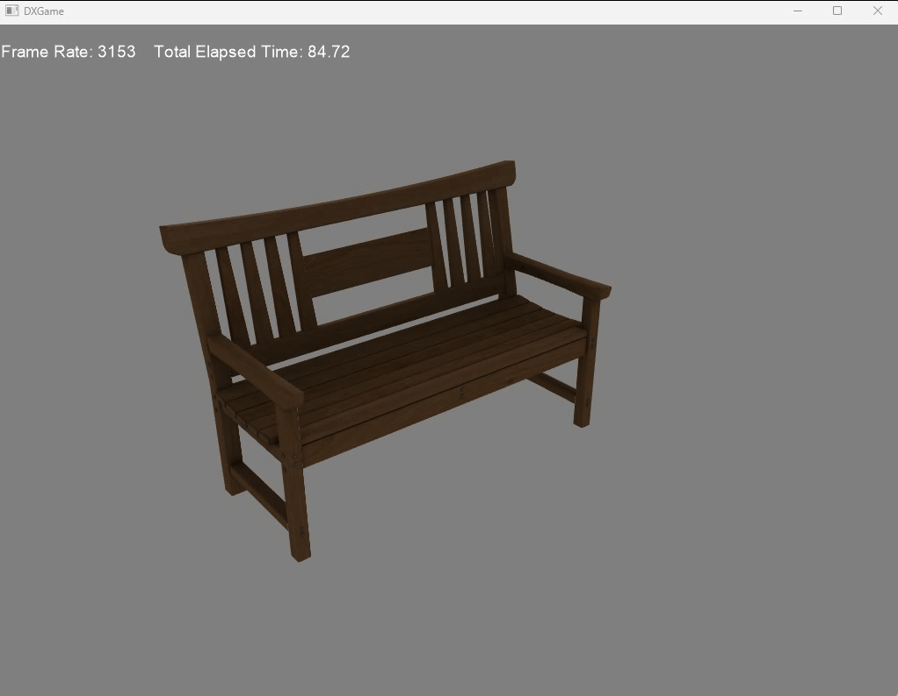

# DXGame

一个基于DX11的渲染器，用到了DirectXTK、Assimp、FX11库

整体步骤
------

- 实现了GameComponent-GameObject-Scene-Game、Varible-Pass-Technique-Effect-Material的层级；

- 默认着色器模型为Blinn-Phong反射模型;

  

- 天空盒;

  

- PBR(没有Kulla-Conty补偿);
  
  

TODOs
------

- PBR(Kulla-Conty)

- Shadow Map

- PCSS
